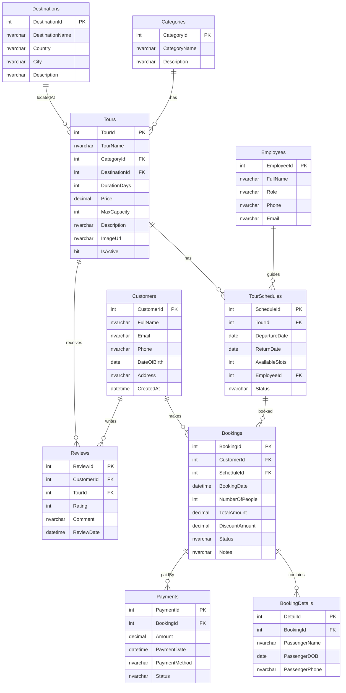

# 📋 Kế hoạch Đồ án — Hệ thống Đặt Tour Du lịch (Travel Tour Booking)

> **Môn học:** Lập trình CSDL | **Nhóm:** 5 người  
> **Stack:** C# / ASP.NET Core Web API / SQL Server / Entity Framework  

---

## 1. Tại sao đề tài này phù hợp?

| Yêu cầu đồ án | Nghiệp vụ Tour Booking tương ứng |
|----------------|-----------------------------------|
| Transaction | Đặt tour: giảm slot, tạo booking, ghi payment — phải ACID |
| Trigger | Tự động cập nhật `AvailableSlots` khi có booking mới |
| View | Báo cáo doanh thu theo tour, theo tháng, tour phổ biến |
| Stored Procedure | Tìm tour, xử lý đặt/hủy tour, thống kê phức tạp |
| Function | Tính giá tour sau discount, tính số ngày tour |
| LINQ to XML | Export danh sách tour/booking ra XML |

---

## 2. Database Schema (10 bảng)



---

## 3. Cấu trúc Solution

```
TravelTourBooking/
├── TravelTourBooking.sln
├── src/
│   ├── TravelTourBooking.API/           # Presentation Layer
│   │   ├── Controllers/
│   │   ├── DTOs/
│   │   ├── Middleware/
│   │   └── Program.cs
│   ├── TravelTourBooking.BLL/           # Business Logic Layer
│   │   ├── Services/
│   │   ├── Interfaces/
│   │   └── Validators/
│   ├── TravelTourBooking.DAL/           # Data Access Layer
│   │   ├── EFCore/ (DbContext, Entities, Configurations)
│   │   ├── ADO/ (AdoRepository)
│   │   ├── Repositories/
│   │   └── Interfaces/
│   └── TravelTourBooking.Common/        # Shared
│       ├── DTOs/
│       ├── Enums/
│       └── Helpers/
├── database/
│   ├── 01_CreateDatabase.sql
│   ├── 02_CreateTables.sql
│   ├── 03_Views.sql
│   ├── 04_Functions.sql
│   ├── 05_StoredProcedures.sql
│   ├── 06_Triggers.sql
│   ├── 07_SeedData.sql
│   └── 08_Transactions.sql
├── docs/report/ (LaTeX)
└── README.md
```

---

## 4. T-SQL Components

### Views (≥ 3)

```sql
-- 1. Doanh thu theo tour
CREATE VIEW vw_TourRevenue AS
SELECT t.TourId, t.TourName, d.DestinationName,
       COUNT(b.BookingId) AS TotalBookings,
       SUM(b.TotalAmount) AS TotalRevenue
FROM Tours t
JOIN TourSchedules ts ON t.TourId = ts.TourId
JOIN Bookings b ON ts.ScheduleId = b.ScheduleId
JOIN Destinations d ON t.DestinationId = d.DestinationId
WHERE b.Status = N'Confirmed'
GROUP BY t.TourId, t.TourName, d.DestinationName;

-- 2. Chi tiết booking kèm thông tin tour
CREATE VIEW vw_BookingDetails AS
SELECT b.BookingId, c.FullName AS CustomerName, c.Phone,
       t.TourName, ts.DepartureDate, ts.ReturnDate,
       b.NumberOfPeople, b.TotalAmount, b.Status
FROM Bookings b
JOIN Customers c ON b.CustomerId = c.CustomerId
JOIN TourSchedules ts ON b.ScheduleId = ts.ScheduleId
JOIN Tours t ON ts.TourId = t.TourId;

-- 3. Tour phổ biến (rating + lượt đặt)
CREATE VIEW vw_PopularTours AS
SELECT t.TourId, t.TourName, t.Price,
       AVG(CAST(r.Rating AS FLOAT)) AS AvgRating,
       COUNT(DISTINCT b.BookingId) AS BookingCount
FROM Tours t
LEFT JOIN Reviews r ON t.TourId = r.TourId
LEFT JOIN TourSchedules ts ON t.TourId = ts.TourId
LEFT JOIN Bookings b ON ts.ScheduleId = b.ScheduleId
GROUP BY t.TourId, t.TourName, t.Price;
```

### Functions (≥ 2)

```sql
-- 1. Tính giá tour sau discount
CREATE FUNCTION fn_CalcBookingTotal(
    @ScheduleId INT, @NumberOfPeople INT, @DiscountPercent DECIMAL(5,2)
) RETURNS DECIMAL(18,2) AS BEGIN
    DECLARE @Price DECIMAL(18,2), @Total DECIMAL(18,2);
    SELECT @Price = t.Price FROM Tours t
    JOIN TourSchedules ts ON t.TourId = ts.TourId
    WHERE ts.ScheduleId = @ScheduleId;
    SET @Total = @Price * @NumberOfPeople * (1 - @DiscountPercent/100);
    RETURN ISNULL(@Total, 0);
END;

-- 2. Đếm số booking của customer trong năm
CREATE FUNCTION fn_CustomerBookingCount(
    @CustomerId INT, @Year INT
) RETURNS INT AS BEGIN
    DECLARE @Count INT;
    SELECT @Count = COUNT(*) FROM Bookings
    WHERE CustomerId = @CustomerId AND YEAR(BookingDate) = @Year;
    RETURN @Count;
END;
```

### Stored Procedures (≥ 4)

```sql
-- 1. Tạo booking (có Transaction)
CREATE PROCEDURE sp_CreateBooking
    @CustomerId INT, @ScheduleId INT,
    @NumberOfPeople INT, @DiscountPercent DECIMAL(5,2)
AS BEGIN
    BEGIN TRY
        BEGIN TRANSACTION;
        -- Kiểm tra slot
        IF (SELECT AvailableSlots FROM TourSchedules WHERE ScheduleId = @ScheduleId) < @NumberOfPeople
            THROW 50001, N'Không đủ chỗ', 1;
        -- Tính tổng tiền
        DECLARE @Total DECIMAL(18,2) = dbo.fn_CalcBookingTotal(@ScheduleId, @NumberOfPeople, @DiscountPercent);
        -- Insert booking
        INSERT INTO Bookings VALUES(@CustomerId, @ScheduleId, GETDATE(), @NumberOfPeople, @Total,
            @Total * @DiscountPercent/100, N'Confirmed', NULL);
        -- Giảm slot (hoặc để Trigger xử lý)
        UPDATE TourSchedules SET AvailableSlots = AvailableSlots - @NumberOfPeople
        WHERE ScheduleId = @ScheduleId;
        COMMIT;
    END TRY
    BEGIN CATCH ROLLBACK; THROW; END CATCH
END;

-- 2. Hủy booking
-- 3. Tìm tour theo destination + khoảng giá + ngày
-- 4. Báo cáo doanh thu theo khoảng thời gian
```

### Triggers (≥ 2)

```sql
-- 1. Khi thêm booking → giảm AvailableSlots
CREATE TRIGGER trg_AfterBookingInsert ON Bookings AFTER INSERT AS
BEGIN
    UPDATE ts SET ts.AvailableSlots = ts.AvailableSlots - i.NumberOfPeople
    FROM TourSchedules ts JOIN inserted i ON ts.ScheduleId = i.ScheduleId;
END;

-- 2. Khi hủy booking → tăng lại AvailableSlots
CREATE TRIGGER trg_AfterBookingCancel ON Bookings AFTER UPDATE AS
BEGIN
    IF UPDATE(Status)
        UPDATE ts SET ts.AvailableSlots = ts.AvailableSlots + i.NumberOfPeople
        FROM TourSchedules ts
        JOIN inserted i ON ts.ScheduleId = i.ScheduleId
        JOIN deleted d ON d.BookingId = i.BookingId
        WHERE i.Status = N'Cancelled' AND d.Status != N'Cancelled';
END;
```

---

## 5. API Endpoints

```
Tours:
  GET    /api/tours                    # Danh sách (pagination, filter)
  GET    /api/tours/{id}               # Chi tiết tour
  POST   /api/tours                    # Thêm tour (admin)
  PUT    /api/tours/{id}               # Sửa tour
  DELETE /api/tours/{id}               # Xóa tour
  GET    /api/tours/search?dest=&priceMin=&priceMax=  # Tìm kiếm

Bookings:
  POST   /api/bookings                 # Đặt tour (→ SP + Transaction)
  GET    /api/bookings/{id}            # Chi tiết booking
  PUT    /api/bookings/{id}/cancel     # Hủy booking
  GET    /api/bookings/customer/{id}   # Lịch sử booking của KH

Reports (dùng Views):
  GET    /api/reports/revenue          # Doanh thu theo tour
  GET    /api/reports/popular-tours    # Tour phổ biến

Customers, Destinations, Reviews, Payments: CRUD tương tự

XML:
  GET    /api/export/tours/xml         # Export tours ra XML
  POST   /api/import/tours/xml         # Import tours từ XML
```

---

## 6. Phân công 5 Thành viên

| Vai trò | Trách nhiệm | Kỹ thuật |
|---------|-------------|----------|
| **TV1 — Lead + DB** | Schema, Views, Functions, SPs, Triggers, Transactions, Git | T-SQL, SQL Server |
| **TV2 — DAL** | EF Code First + DB First, ADO.NET (DataSet/DataAdapter), Repositories | EF Core, ADO.NET |
| **TV3 — BLL** | Services, Validation, LINQ to Objects, LINQ to XML | LINQ, C# |
| **TV4 — API** | Controllers, DTOs, Swagger, Error handling, Auth cơ bản | ASP.NET Core, REST |
| **TV5 — Test + Docs** | Postman testing, Seed data, Báo cáo LaTeX, README | Testing, LaTeX |

---

## 7. Timeline 5 Tuần

### Tuần 1: Setup
- TV1: ERD → SQL scripts tạo DB + Tables + Seed data
- TV2: Setup Solution 4 projects, EF entities
- TV3–TV4: Nghiên cứu LINQ, Web API
- TV5: Setup LaTeX, Git repo

### Tuần 2: Database + DAL
- TV1: Views, Functions, SPs, Triggers, Transactions
- TV2: EF DbContext, ADO.NET repo, Repository pattern
- TV3: LINQ to Objects demo queries
- TV5: Test SQL scripts

### Tuần 3: BLL + API
- TV3: TourService, BookingService, CustomerService + LINQ to XML
- TV4: Controllers, DTOs, Swagger setup
- TV2: DAL integration với SP/Views
- TV5: Postman collection, bắt đầu test

### Tuần 4: Tích hợp
- API → BLL → DAL → DB end-to-end
- Transaction workflow (đặt tour)
- Pagination, filtering, search
- Test toàn bộ flow
- Viết LaTeX Chương 1–3

### Tuần 5: Hoàn thiện
- Code review, refactor
- LaTeX Chương 4–5
- README, demo
- **Chuẩn bị vấn đáp: mỗi người hiểu toàn bộ project**

---

## 8. Dàn ý Báo cáo LaTeX

```
Chương 1: Giới thiệu (đặt vấn đề, mục tiêu, phân công)
Chương 2: Cơ sở lý thuyết (3-layer, T-SQL, ADO.NET, LINQ, EF, Web API)
Chương 3: Phân tích & Thiết kế (Use Case, ERD, Component Diagram, API design)
Chương 4: Hiện thực (code + screenshots từng layer)
Chương 5: Kết luận (kết quả, hạn chế, hướng phát triển)
```

---

## 9. Checklist nộp bài

- [ ] ≥ 3 Views, ≥ 2 Functions, ≥ 4 SPs, ≥ 2 Triggers, Transaction
- [ ] 4 projects: API / BLL / DAL / Common
- [ ] ADO.NET connected + disconnected model
- [ ] LINQ to Objects + LINQ to XML + LINQ to Entities
- [ ] EF Code First + Database First demo
- [ ] RESTful API + Swagger + JSON
- [ ] DTOs tách biệt Entities
- [ ] GitHub public + README
- [ ] LaTeX report đúng dàn ý
- [ ] Mỗi thành viên hiểu toàn bộ project (vấn đáp)
